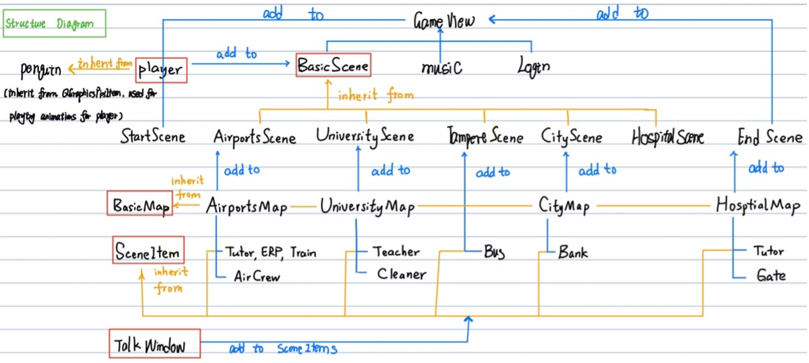
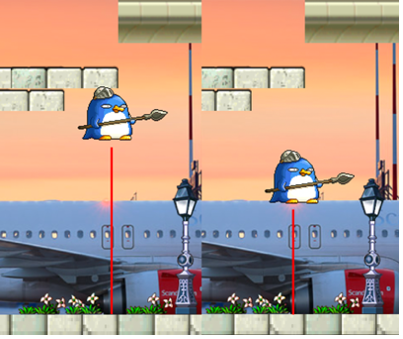
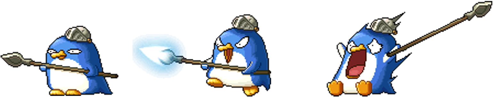
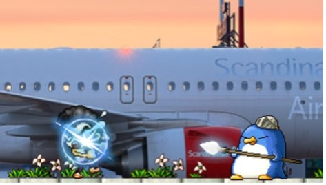
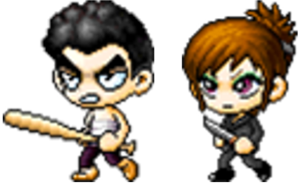
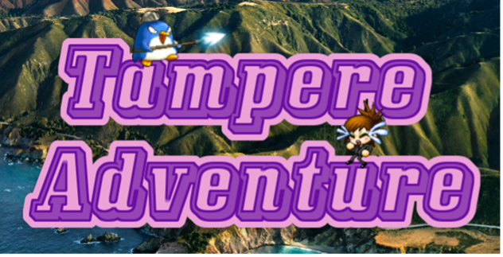
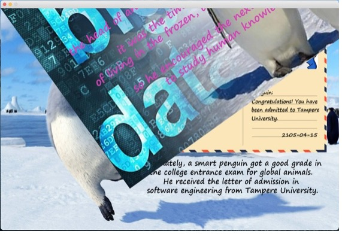
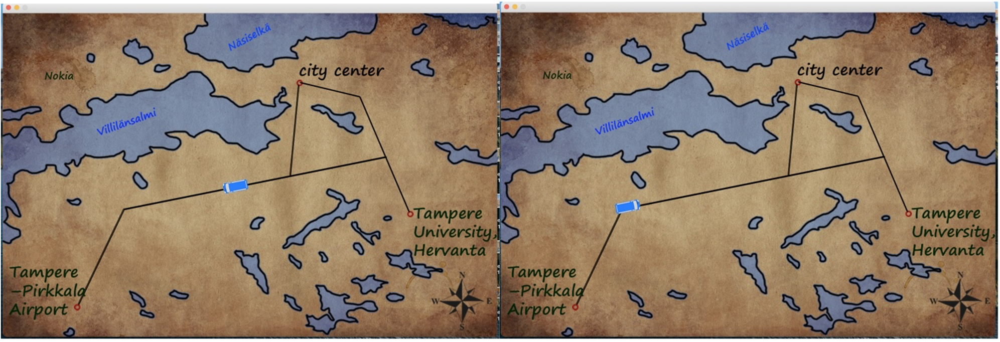
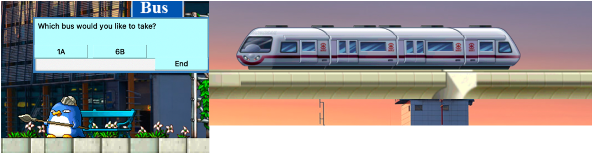

# Penguin Advanture

> This is a side-scrolling role-playing game (the final project of c++ programming course), and a linear game with three main scenes and some assisted scenes. In this game, player controls a penguin, a newcomer to Tampere,Finland who received the letter of admission from Tampere University (TAU). They must escape by destroying hostile monsters, avoiding traps and obtain the necessary items to register successfully at TAU. 

### Game Mechanics
1. Game-rules
  - move your character in the scenes to find a new way
  - talk with NPCs to get important information
  - battle against monsters to avoid death

2. Game-controls
  - move left and right with the "arrow" keys  
  - jump with the "space" key. The height of jump depends on the time of pressing "space"
  - talk with NPCs by clicking mouse 
  - attack monsters with the "a" key
 
 
### Software Structure
1. Structure Diagram

 2. Project Functionality
- Player can interact with objects: jump, move, die, battle with enemies, chat with NPCs
- Player can interact with scenes: get bank card at the bank, take train in the airport, take different buses in Tampere map

 
### Classes
> Reponsibilities of the key classes
- Player: 
    1) Store player’s current position, status(move, stand, ...) and directions(move left or right)
    
    2) Store player’s current map( which map the player is current in: city, university or others)
    
    3) Check if player is on ground, at celling, or pushing the block, according to current map
    
    4) Update player’s status and play different animation, according to 3)

- BasicScene:
    1) Connect scene and QTimer to update the scene
    
    2) Provide virtual function for child class to use, such as functions for initializing scene, adding enemies, adding QGraphicsItems

- BasicMap:
    1) Store types for all tiles in the map by reading csv files
    
    2) Convert scene coordinates into tile index, vice versa
    
    3) Return the tile type, given scene coordinates
    
    4) Store all the NPCs’ position

- GameView:
    1) Set current background music and current scene the player is in 
    
    2) Connect signals of different scenes and the slots in this class to switch current scene and it’s corresponding BGM 

### Some game features
1. Character
- Player
    1) Higher and nomal jump based on the duration of pressing "jump" key
    
                                                              
    2) The penguin has different animation when it is walking, attacking or being killed.
    

- Enemy
    1) Enemies would kill the player character.
    2) Enemies would be killed by the player character.
    3) Enemies have the effect when they are attacked. 
    

    4) All of enemies would be revived when player changes scenes. 
    5) Two kinds of enemies.
    

 
 
2. Scenes
- Main scenes: airport scene, city scene and university scene (player can input)
- Assistance scenes: tampere scene, hospital scene (player cannot input)
- Other scenes: start scene and end scene
- Features in all scenes
    1) The penguin has sound effects of attack, jump and die. 
    2) Add background music.
    3) The player character can not pass the scenes’ boundaries. 
    4) Background, terrain, enemies, NPCs would move when the player character moves. Those objects and background are in long or medium shot so their moving speed is less than the player character. 
    5) The transition of main scene and assistant scene would be triggered by the player character. They are shown as: choosing bus routes, bus moving to its destination, the player character dies.

- Features in opening cinematic
    1) Qdialog shows after splash screen. Then, the opening cinematic starts. 
    
 
    2) The opening cinematic consists of four pictures. Each of them has its own prologue.  Each prologue ends, the next picture would show. 
    3) Four pictures changes like turning pages.
    
 

- Features in the scene of Tampere 
Given the starting and ending points’ coordinates, the bus would move along the connection line with correct angle. 

 
3. Objects
- NPCs
    1) NPCs have their own animation. 
    2) NPCs can talk with player    
    3) The chat could be run forward or back.
    4) The mouse would change its appearance when clicking buttoms, from arrow to hand.
    5)School teacher has two kinds of animation: talking and being quiet. 
    6)School teacher (right figure) and tutor in hospital (left figure) have different scripts based on player’s situation. 
    

- Movable objects
    1) Bus: player chooses bus route and the bus can move on the map of Tampere freely (the left figure below).

                 
    
    2) Train: the train can move in the airport. Before boarding the train, the player character can’t walk on the track because of the transparent wall. During this process, the player character would be invisible and its movement would be locked (the right figure above).
 
 - Tiles
There are three types of tiles: blocks, platforms and none tiles. Player character can move on platform; stop by blocks; fall on none tiles.

### Problems in this project
Due to the limit time (because this is a final project of a course), my codes are not perfect, clean in my point of view, like, I just use the QT garbage collection mechanics and didn't hanle with memeory management, which is very important in c++ program. Additionally, the architecture of classes are not very good and I didn't finish the UniTest and exception handling part. I hope that I will have time to optimize my codes as my programming skills gradually get improved :blush: .
